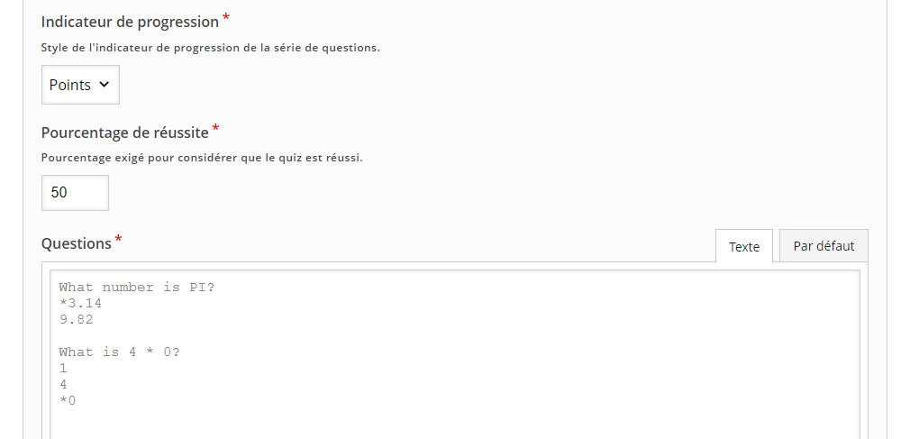
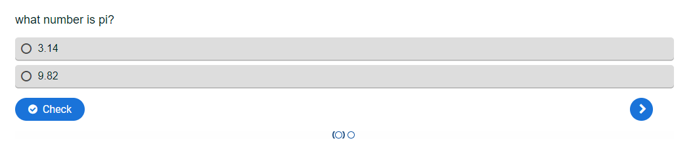
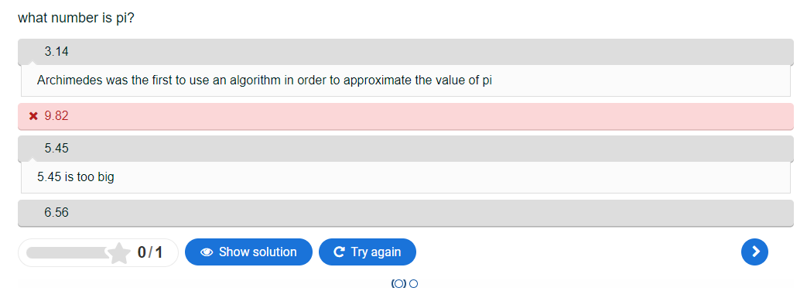
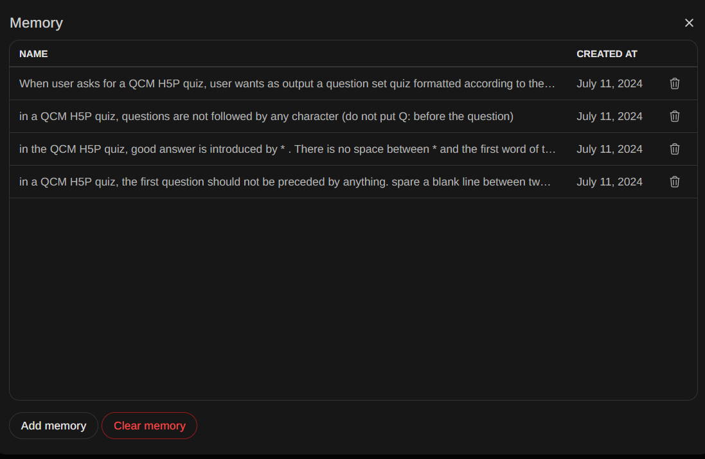

# Introduction

Avec le développement de l'auto-formation et des cours interactifs en ligne, les enseignants et les personnels dédiés à l'ingénieurie pédagogiques passent de plus en plus de temps à constituer des quiz pour permettre aux étudiants de s'entraîner dans le cadre d'un cours en ligne. Les deux outils privilégiés sont Moodle, un LMS[^1] libre très utilisé dans l'enseignement supérieur français et le format H5P, basé sur l'HTML5, interopérable avec Moodle comme avec d'autres outils libres et qui permet de concevoir des activités pédagogiques de toute sorte et parmi ces activités des questions à choix multiples. 
Ces tâches de conception prennent du temps, non seulement en conception (concevoir les questions à poser à partir d'un contenu et les retours à envoyer en cas de bonne ou mauvaise réponse), mais aussi en terme de saisie. En effet, les activités h5P se présentent au premier abord sous la forme de templates à compléter, que l'on utilise pour cela un éditeur intégré à Moodle ou bien un éditeur indépendant[^2]. 
Pour ces deux étapes, le recours à des outils d'intelligence artificielle peuvent permettre d'épargner du temps de conception. Il est évident que les productions des outils d'IA en la matière doivent être revues et assez souvent corrigées ou adaptées par un intervenant humain, mais ces textes générés automatiquement constituent néanmoins une bonne base de départ pour réaliser rapidement des quiz. 
Lorsqu'en rapport à un document qu'on lui fournir, le RAG[^3] peut produire des questions à choix multiples qui aient du sens, il convient encore que ces questions et les réponses proposées (ainsi que les feedbacks) soient rédigés dans la syntaxe alternative proposée par les éditeurs H5P pour certaines activités. Cette syntaxe légère permet de ne pas avoir à remplir de formulaire, ce qui constitue un gain de temps non négligeable. La question est donc de savoir comment faire en sorte que l'outil d'IA utilisé formate les quiz qu'on lui demande de générer dans la syntaxe demandée. C'est l'objet du travail qui est résumé ici. 

# 1. L'éditeur H5P et le formatage des questions et des réponses

Les éditeurs d'activités en H5P permettent de réaliser une [variété assez importante d'exercices](https://h5p.org/content-types-and-applications). Certaines de ces activités permettent une édition à travers un formulaire uniquement (c'est le cas de *multiple choice*), d'autres comme l'activité *Question Set* offrent une voie alternative pour la conception : au lieu de passer par le formulaire, il est possible de copier-coller directement du texte faiblement balisé dans le champ principal. Ce texte une fois collé sera parsé et constituera le quiz qui s'affichera à l'étudiant. 
Ainsi, en prenant l'exemple fourni du nombre pi 



on peut constituer très rapidement en copiant le texte ci-dessous : 

```
what number is pi?
*3.14
9.82

What is 4*0
1
4
*0
```
le quiz suivant : 



La première ligne est occupée par la question. Les lignes suivantes par les alternatives. La bonne alternative est signalée par un astérique, elle n'est pas obligatoirement présente en tête des alternatives disponibles. une ligne vide sépare chaque question.

Lors de l'édition, il est nécessaire d'ajouter un titre à l'activité pour que celle-ci soit validée. Cette étape ne pourra pas se faire aisément avec un outil d'IA. Ce qui peut être généré en revanche avec un outil d'IA, c'est la question elle-même, ses options de réponse et son feedback. 
Pour ce dernier, la syntaxe est la suivante : 

```
what number is pi?
*3.14:::Archimedes was the first to use an algorithm in order to approximate the value of pi
9.82:pi is the equivalent of 22/7
5.45:::5.45 is too big
6.56
```
on peut éditer une astuce pour aider l'étudiant à faire son choix au moyen du signe : . Ainsi dans notre exemple, pi is the equivalent of 22/7 sera lisible dans une infobulle reliée à l'alternative 9.82
Lorsque l'étudiant a donné sa réponse et cliqué sur *check*, la solution lui est donnée avec les feedback : 
chaque feedback est attachée à une alternative. Le triple signe ::: permet de séparer le feedback de l'alternative que celle-ci soit bonne ou mauvaise.
A noter toutefois que le feedback lié à l'alternative choisie ne s'affiche pas.



# 2. L'usage des outils d'IA pour générer des quiz à partir d'un document.

Dans la catégorie des outils d'intelligence artificielle générative, nous nous intéressons ici à ceux qui peuvent traiter des documents qu'on leur soumet. Ces outils sont dénommés RAG (Retrieval Augmented Generation Tools). Les tests suivants ont été réalisés avec RAGaRenn, l'outil d'IA installé sur le serveur d'un partenaire de l'Université de Rennes.
Mixtral est le modèle qui a été choisi pour ces tests. RAGaRenn ne dispose pas du modèle utilisé dans Poe pour obtenir le résultat mentionné plus haut (Claude3.5-Sonnet)

Pour la leçon dont il faut extraire des quiz, la vidéo introductive d'une chercheuse sur la différence entre intégrité scientifique et éthique scientifique a été utilisée. Cette différence était présentée au moyen de l'exemple d'une étude sur l'élevage de poules. L'outil d'IA n'est pas en mesure de déterminer que cet exemple n'est pas central dans le cours filmé, mais comme il occupe la place centrale (en nombre de mots), c'est sur cet exemple qu'on été générés les quiz demandés (et pas sur les questions plus abstraites d'éthique et d'intégrité scientifique). 
Ce n'est pas la vidéo elle-même qui a été fournie à l'outil d'IA mais sa transcription réalisée par l'outil d'IA qui accompagne le gestionnaire de vidéos Ubicast installé sur un serveur de l'Université. Chaque vidéo chargée sur ce serveur permet d'obtenir en quelques secondes un *transcript* sans trop d'erreurs, et une traduction de ce transcript en anglais. 
Le document fourni à l'outil d'IA est le transcript en français.


Au Moodlemoot de juillet 2024, à Marseille, un intervenant a montré comment générer des *question sets* pour H5P avec l'IA [Poe](https://poe.com) et le modèle Claude3-5.Sonnet.

En chargeant sur Poe le PDF d'une leçon et en rédigeant le prompt suivant : 

```prompt

Agis comme un enseignant qui créer un QCM dans Moodle. Ce QCM doit être composé de 3 questions avec 4 réponses alternatives. Le QCM ne prendra en compte que le document joint.  
Le QCM doit respecter les conditions suivantes :  
La bonne réponse devra apparaître aléatoirement parmi les autres  
La bonne réponse aura pour prefixe *  
La bonne réponse aura pour suffixe ::: et une explication issu du document  
Toutes les réponses n’auront aucun numéro ni autre format  
Aucune ligne vide entre les questions et les réponses

```
H5P n'est pas mentionné dans le prompt, mais les éléments de la syntaxte attendue pour la réponse sont bien explicités. Le résultat est conforme à ce que H5P prévoit : 

```
Quel avantage les poules aveugles présentent-elles par rapport aux poules voyantes selon l'étude ?
Elles ont un taux de cortisol sanguin plus bas
Elles ont des glandes surrénales plus petites
Elles sont plus résistantes aux maladies
*Elles pondent davantage ::: L'étude conclut que "les poules aveugles pondent davantage que les poules douées de vision"
```
le [résultat](https://poe.com/s/Qv2dyZ3LtOMPywKDJDcM) est conforme à ce qui a été présenté à Marseille, avec un texte précédent. La syntaxe utilisée est adéquate et permet bien de fabriquer un *question set* avec H5P.

# 3. Obtenir de RAGaRenn qu'il formate les quiz demandés selon la bonne syntaxe

## 3.2 Utilisation du modèle Mixtral 

Poe est un outil commercial et limité dans son usage. Une même personne ne peut pas dépasser un nombre d'inférences par jour sans payer un abonnement.
Comment réaliser cette même tâche avec un outil local comme RAGaRenn qui n'est pas formellement limité en nombre d'inférences par personne et par jour et ne présente pas le risque de réutilisation des données personnelles (mail) associé à ce type d'outils commerciaux ?
Pour utiliser RAGaRenn, j'ai décidé d'utiliser le modèle Mixtral pour l'ensemble des tests.Mixtral 47B est est un modèle de fondation pouvant être comparé avec le modèle Claude dans sa version 3.5. Avec le même prompt que celui fourni par Claude3.5 dans Poe, RAGaRenn fournit un quiz en anglais (le prompt était pourtant rédigé en français) et formaté de la manière suivante : 

Question 1 : texte de la première question
A\) alternative 1
B\) alternative 2
C\) alternative 3
Question 2 : texte de la seconde question
A\) alternative 1
...
Correct answers (with prefix and suffix):
Question 1: A\)*
alternative 1 ::: texte du feedback
Question 2: B\)

De même que Claude3.5 dans Poe était paramétré pour générer des quiz dans lesquels la première alternative était toujours la bonne (ce qui avait nécessité l'inclusion d'une phrase lui indiquant que cet ordre devait être aléatoire), de même, par défaut, Mixtral génère du texte qui sépare la question et ses options de réponse de la définition de la bonne réponse. Par ailleurs, le résultat est systématiquement formulé en anglais, et des préfixes non souhaités viennent s'ajouter aux questions et aux réponses (cf. **Question 1**, **Question 2** / **A)** alternative 1, **B)** alternative 2,etc.)

Le prompt doit permettre d'éviter ce fonctionnement par défaut de se réaliser. 

Après plusieurs essais erreurs, j'ai réalisé que je n'y arriverais pas seulement en ajoutant de nouvelles règles dans le prompt. 
J'ai donc prévu d'englober dans le prompt initial un exemple de quiz bien formaté pour guider l'IA : 

```
un quiz H5P est formaté de la manière suivante : 

la première ligne est une question
la seconde est une réponse proposée
la troisième et les deux suivantes sont d'autres réponses proposées. 
la bonne réponse est précédée de *
la bonne réponse n'est pas forcément la première, cela peut-être n'importe laquelle
il peut y avoir jusqu'à six options différentes
la bonne réponse est assortie d'un feedback donnant des informations complémentaires. la bonne option de réponse est séparée du feedback par :::

Voici un exemple : 

Comment est mort Jules César?
victime d'un accident
mort d'une insolation
*mort assassiné:::il a été assassiné par des sénateurs conjurés parmi lesquels se trouvaient son fils adoptif Brutus

```

Ce prompt a permis d'obtenir un [résultat conforme](chat/intégrité.txt) avec le [texte sur l'éthique](documents/ethique.txt)

Ce résultat n'a pas pu être reproduit avec le même prompt mais basé sur d'autres documents.
Les mêmes éléments indésirables revenaient périodiquement dont voici une liste non exhaustive : 

- une mention question 1, question 2, question 3, etc. occupent la ligne vide entre chaque question
- l'astérique devant la bonne réponse est suivie d'un espace indésirable, ce qui fait qu'elle est interprété comme une puce. Les options sont présentées comme une liste à puce. La bonne option n'est pas précédée mais suivie d'un astérique.
- Régulièrement les options apparaissent aussi avec des A), B), C), etc.
- Régulièrement les questions et leurs options sont dissociées de l'identification de la bonne réponse qui apparaît après la liste des options. 

## 3.3 mémorisation des règles

Dans le [groupe ARDEL](https://ragarenn.eskemm-numerique.fr/ardel@univren) où je dispose d'un compte d'administrateur et où j'ai ainsi accès à certaines fonctionnalités supplémentaires, j'ai essayé de créer une mémoire de mes instructions à RAGaRenn : 



Dans un prompt on définit ce qu'on entend par **QCM H5P quiz** en reprenant les règles déjà édictées (respect de la syntaxe prévue par H5P)
Ensuite on interroge l'outil d'IA (Mixtral toujours) en lui demandant de faire un **QCM H5P quiz**
Par exemple : "génère un QCM H5P quiz sur l'indépendance de l'Inde"
On créé un nouveau chat à chaque fois.
Pour simplifier le test, j'ai décidé de ne pas soumettre de texte à RAGaRenn à partir duquel générer les quiz. Les quiz générés sont construits à partir des sources utilisé pour bâtir le modèle.

### question sur l'indépendance indienne

```
Q: Qui est considéré comme le père de la nation indienne?
*Mahatma Gandhi:::Mohandas Karamchand Gandhi, communément appelé Mahatma Gandhi, était un leader politique et spirituel indien qui a joué un rôle clé dans l'obtention de l'indépendance de l'Inde en menant des campagnes non violentes de désobéissance civile.
Jawaharlal Nehru
Subhas Chandra Bose
Q: Quel a été le prix que l'Inde a dû payer pour son indépendance?
*La partition de l'Inde et du Pakistan:::L'une des conséquences les plus dévastatrices de l'indépendance de l'Inde a été la partition du pays en deux États distincts : l'Inde et le Pakistan. Ce processus a entraîné des violences massives, des déplacements forcés et des pertes humaines considérables.
La fin du Raj britannique
L'unification de toutes les régions de l'Inde
```

-> ajout de deux règles : la question ne doit pas être précédée par aucun caractère + une ligne vide doit séparer les questions 

### question sur El Niño

```
Qu'est-ce que El Niño?
une variation temporaire de la température de l'océan Pacifique équatorial
un ouragan qui se forme dans l'océan Atlantique
 -  un phénomène météorologique et océanographique qui affecte les courants marins et la température de l'eau dans l'océan Pacifique tropical :::El Niño est associé à une augmentation de la température de surface de l'océan Pacifique équatorial, ce qui peut avoir des répercussions sur le climat mondial.


Quand se produit généralement El Niño?
tout au long de l'année
uniquement en hiver
  - à des intervalles irréguliers, généralement tous les 2 à 7 ans ::: Bien que El Niño puisse se produire à tout moment de l'année, il a tendance à être plus fréquent pendant les mois d'hiver.

```
Résultat : les précédentes règles sont respectées mais on constate un nouveau problème : l'astérique se transforme en puce devant la bonne réponse
-> ajout d'une règle pour empêcher qu'un espace ne vienne s'insérer entre l'astérique et le premier mot de la bonne réponse.

### question sur la cinqième constitution française

```
Question 1:
Quand a été promulguée la cinquième constitution de la République française?
*en 1958:::elle a été adoptée par référendum le 28 septembre 1958
Après les élections législatives de 1962
Lors de l'élection présidentielle de 1965
En 1968, à la suite des événements de mai

Question 2:
Quel est le régime politique établi par la cinquième constitution de la République française?
Une république parlementaire
Une monarchie constitutionnelle
*Une république semi-présidentielle:::le président dispose de pouvoirs importants, notamment en matière de défense et de politique étrangère, tandis que le Premier ministre est responsable devant l'Assemblée nationale
Une dictature militaire
```

Résultat : plus de puce  mais retour d'un intitulé numérotant la question 
-> ajout d'une règle prescrivant ce fonctionnement

### question sur la Ceinture de Kuiper

```

    What is the largest known object in the Kuiper Belt?


Answer: Pluto


    Which dwarf planet in the Kuiper Belt has the longest orbital period?


Answer: Eris


    Which of the following objects in the Kuiper Belt is not a dwarf planet?


A) Makemake
B) Haumea
C) Quaoar
D) Varuna
```

l'intitulé question 1 disparaît mais toutes les autres règles déjà implémentées sont ignorées.


# conclusion

Contrairement au fonctionnement du LLM Claude3.5-Sonnet à travers Poe qui permet facilement et de façon reproductible de générer des quiz dans la syntaxe prévue par le standard h5p, il n'a pas été possible d'obtenir la même chose avec le modèle Mixtral dans RAGaRenn que ce soit avec un compte de particulier ou bien avec un compte d'administrateur en utilisant la fonctionnalité bêta "mémory" qui permet de donner des instrutions à mémoriser au chatbot. 


[^1]: Moodle appartient à la famille des LMS (Learning Management Systems)
[^2]: Comme Logiquiz l'éditeur libre d'activités H5P mis en place par la Digitale